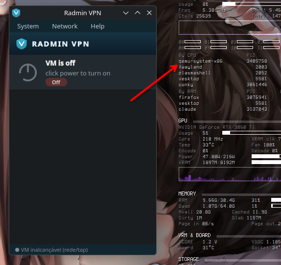

# Radmin VPN (Linux) — unofficial

Run a **Windows-only** app (Radmin VPN) on Linux, looking native, without the user
ever seeing Windows. A Qt UI drives the **real** Radmin running inside a headless
Windows 7 VM. See `IDEA.md` for the concept and the sections below for the
per-component architecture.

## Install (one command)

Works on **any distro** — QEMU/KVM runs on any kernel. This installs the deps, imports
the VM, sets up the isolated network, and creates the menu shortcut:

    curl -fsSL https://raw.githubusercontent.com/gabrielmf1998/Radmin-Linux-KDE/main/bootstrap.sh | bash

Prefer a native package? Build one for your package manager:

| distro | build | install |
|---|---|---|
| Fedora / RHEL (.rpm) | `packaging/build-rpm.sh` | `sudo dnf install ./radmin-linux-*.noarch.rpm` |
| Debian / Ubuntu (.deb) | `packaging/build-deb.sh` | `sudo apt install ./radmin-linux_*.deb` |
| Arch / Manjaro (PKGBUILD) | `cd packaging && makepkg -si` | (makepkg installs it) |

The VM image (~2-3 GB compressed) is fetched from the GitHub Release, not stored in git.

> **Tiny footprint — 512 MB RAM · 1 CPU.** The bundled Windows VM runs on **512 MB of
> RAM and a single CPU** on purpose, so it never hogs the machine of whoever installs
> it. This is declared right in the app header. If a heavier Windows peer ever needs
> more, override with `RADMIN_VM_RAM` / `RADMIN_VM_SMP` (Windows 7's own minimum is
> 1 GB, so bump to 768-1024 if the VM is too slow to boot).

## Status (where we stopped)

**Works end to end.** From zero to daily use:

- ✅ **UI** (`app/`): turn the VM on/off, connect/disconnect, see peers
  (online and offline), rename the node, **multi-network bar**, tray with full
  control, menu icon.
- ✅ **VM agent** (`agent/`): auto-configures ICS at boot, auto-heal, auto-update.
- ✅ **Install**: `install.sh` (multi-distro), `bootstrap.sh` (curl | bash),
  RPM + Arch packages in `packaging/`.
- ✅ **Image build**: `build-vm.sh --from-scratch WIN.iso` (from bare Windows to a
  ready VM, 100% automatic, validated) or `--clean` (from a VM that already works).
  Base image in `dist/` (not versioned, ~3 GB).
- ✅ **Stability**: opening the app does **not** start the VM or freeze the machine
  (the launcher uses `preflight.sh --light`); it runs at low I/O priority. Querying
  the VM is **manual by default** (System → *Auto-refresh* opts into 30s polling;
  *Refresh now* queries once), so nothing hits the VM in the background. The liveness
  check is **process-free** (unprivileged ICMP sockets — no `ping` processes).
- ✅ **Peers grouped by network**: collapsible per-network sections (manual grouping
  via right-click → *Move to network*), a Network → *Show online only* filter, and a
  *＋ Network* button up top.

**Missing / next steps:**
- Powering the VM on still costs ~1-2 min of Windows boot (at low priority; without
  freezing). It could be smoothed (a "starting…" hint, fewer vCPUs at boot).
- Filtering peers **per network** for real and showing the **real network name**
  require decoding the `RadminVpnGuiChannel` LPC protocol (today: the chip
  highlights the network; names are local nicknames).

> Historical note: this started as a read-only clone (phase 2) and grew into full
> control + automatic provisioning. The "phase 2" mentions below are from that start.

    radmin-linux/
    ├── agent/          scripts that run INSIDE the VM (Windows)
    │   ├── net-orchestrator.ps1  ensures ICS at boot (fixes ordering)
    │   ├── power-guard.ps1       VM never sleeps/hibernates/reboots
    │   ├── radmin-update.ps1     finds the latest version on the page and installs
    │   ├── health.ps1            diagnoses and AUTO-REPAIRS each component
    │   └── agent-install.ps1     registers the boot tasks
    ├── app/            Linux client
    │   ├── main.py     Qt UI (clone) + tray
    │   ├── backend.py  transport: calls the shim over WMI and parses the JSON
    │   ├── roster.py   persistent peer list (offline + local nicknames)
    │   ├── vmctl.py    turns the whole VM on/off (QEMU monitor + preflight)
    │   ├── agent.py    triggers the agent scripts and reads updates
    │   ├── discover.py GUI dump → complete peer list (online+offline)
    │   └── icons.py    logo/signal/power drawn with QPainter
    ├── shim/
    │   └── radmin-shim.ps1   runs in the VM, returns Radmin state as JSON
    ├── radmin-linux.sh   opens the UI (auto-repairs the stack first)
    ├── deploy-shim.sh    (re)sends the shim to C:\ in the VM
    └── deploy-agent.sh   (re)sends the agent to C:\radmin-agent in the VM

## How it works

    UI (Linux) ──WMI/impacket over the tap──▶ Windows VM ──▶ real Radmin
                bench:bench@192.168.137.1         C:\radmin-shim.ps1

- **node** (name/IP/status): from the VM itself
- **online peers + IP**: ARP table of the Radmin adapter (real time)
- **peer hostname**: NetBIOS (`nbtstat`)
- **nickname**: double-click a peer — local, UI-only (does not touch Radmin)
- **offline**: the roster remembers who was seen; **liveness via ICMP sweep** from
  Linux (we have a route to 26.0.0.0/8) every 30s — whoever does not reply is offline
- **connect/disconnect**: click the power button or Network menu → stops/starts the
  RvControlSvc (the mesh's real switch). Validated: drops/restores the peers.
- **leave network**: Network menu → removes the association (Networks\{GUID} key)
- **join/create network**: needs the Radmin server (proprietary protocol) — the UI
  opens the real Radmin window in the VM (VNC) for you to do it, then refreshes

## Usage

    ./radmin-linux.sh    # auto-repairs the stack and opens the window (closes to tray)

The launcher runs `preflight.sh`, which checks and fixes 7 layers before opening:
venv, tapradmin interface, DHCP, VM up, network, WMI, shim in the VM. If the tap
lost carrier (tun device recreated with the VM alive) it **restarts the VM** by itself.

    ./preflight.sh       # runs only the check/repair (use -q for errors only)
    ./deploy-shim.sh     # resends the shim manually

## Limits (honest)

- The real GUI shows the **Radmin nickname** ("ALICE-LAPTOP"); the shim only reaches
  the **NetBIOS hostname** ("BOB-PC"). The pretty nickname lives in the LPC protocol
  (`RadminVpnGuiChannel`) — decoding it would be a separate phase.
- Each refresh costs ~15-20s (WMI reconnects the SMB + nbtstat per peer).
- Depends on: VM up, tap `192.168.137.2` alive, UAC disabled in the VM.

## Config (env)

    RADMIN_TARGET=bench:bench@192.168.137.1   # WMI target
    RADMIN_SHIM='C:\radmin-shim.ps1'          # shim path in the VM

## Automation (VM agent)

The agent runs **by itself at VM boot** (scheduled tasks) and is controllable from the UI:

| script | when | what it does |
|---|---|---|
| `power-guard.ps1` | boot (SYSTEM) | locks power: no sleep/hibernate/monitor-off, WU without reboot |
| `net-orchestrator.ps1` | boot +30s, and at logon | waits for Radmin to connect, ensures ICS (Radmin=public, isolated=private) |
| `radmin-update.ps1` | on demand | **finds the latest version by scraping the official page**, installs silently |
| `health.ps1` | every 5 min (SYSTEM) + on demand | diagnoses 6 components and **fixes by itself** whatever is broken |

Install/repair: `./deploy-agent.sh` + menu **System → Install/repair agent**.

## The UI power button = the whole VM

For the user, **Radmin VPN (Linux) is the VM**. The power button:
- VM on → shuts the VM down (clean ACPI via the QEMU monitor)
- VM off → starts the VM (via preflight, which auto-repairs the stack)

Validated: power off from the UI → power back on from the UI → the agent reconfigures
everything at boot and `RvControlSvc` returns to Running by itself. **With ICS there
is no L2-bridge deadlock.**

## Auto-heal — the portal never needs you to look at the VM

`health.ps1` checks and **repairs** 6 components, returning a JSON report:

| component | how it fixes it |
|---|---|
| Radmin service | restarts RvControlSvc |
| Mesh IP (26.x) | (diagnostic) |
| Sharing (ICS) | reapplies Radmin=public / isolated=private |
| Bridge to Linux (192.168.137.1) | (diagnostic) |
| Power locked | `powercfg -h off` + timeouts zeroed |
| Boot agent | (diagnostic) |

**Double redundancy:**
- the UI runs `health -Heal` every 2 min in the background (silent auto-heal)
- the VM runs `health -Heal` every 5 min (SYSTEM task) even with the UI closed

Validated: stop the service → the portal detects it and restarts it by itself
(`healed: true`), without touching the VM. Menu **System → Full diagnostics** shows
the visual report.

## Automatic version discovery

`radmin-update.ps1` downloads the official page on the VM itself, extracts the highest
`Radmin_VPN_<version>.exe`, compares it with the installed `RvRvpnGui.exe`, and installs
if newer. When Famatech publishes a new version, the portal detects it with no fixed URL.

## Full member list (online AND offline)

To give confidence that you are connected to a real network, the UI shows **all
members**, not only the active ones. The full list (the same one the Radmin GUI shows)
lives only in the GUI process memory — `discover.py` takes a minidump of `RvRvpnGui`,
downloads it (~200MB, seconds over the tap) and extracts the 26.x IPs (via UTF-16,
reliable) and the names (best-effort, in-memory correlation).

- runs automatically ~8s after opening, and via **Network → Sync network members**
- the IPs are the solid base; names come from 3 sources: manual nickname > NetBIOS
  (online) > name discovered in memory > IP
- the ping sweep keeps online/offline; offline shows greyed out with an X

## Rename the node

**Network → Rename this node…** (or double-click the name at the top) changes Radmin's
`Alias` — the name the other peers see. It persists in the registry and restarts the
service to re-announce to the mesh. Validated: it changes and does not revert after
reconnecting.

## Install and distribution (all automated)

| tool | what it does |
|---|---|
| `install.sh [IMG]` | sets up the stack on a clean target: KVM, deps, venv, code, imports the VM, creates tap+DHCP, writes the config, creates the shortcut |
| `build-vm.sh --from-scratch WIN.iso` | provisions the VM from ZERO: unattended Windows → Radmin → agent → base image. 100% automatic. |
| `build-vm.sh --clean` | cleans an existing VM for distribution (leaves the network, resets identity) |
| `packaging/build-rpm.sh` | builds the RPM (`radmin-linux-*.noarch.rpm`) |
| `packaging/PKGBUILD` | Arch package (`makepkg`) |

The package carries only the code (light); the VM image (~2-3 GB compressed) is shipped
separately because it is large and carries state.

## Central config

Everything in one place: `app/config.py` (Python) and `env.sh` (shell) read, in order,
environment variables → `~/.config/radmin-linux/config.env` → defaults. Zero hardcoded
paths — `install.sh` writes the target's `config.env`.

## Everything from the tray

The tray icon controls everything — turn the VM on/off, connect/disconnect, diagnostics
with repair, update, sync members — and the tooltip reflects the state. **The user never
opens the VM.** A watchdog restarts the VM if it hangs.
